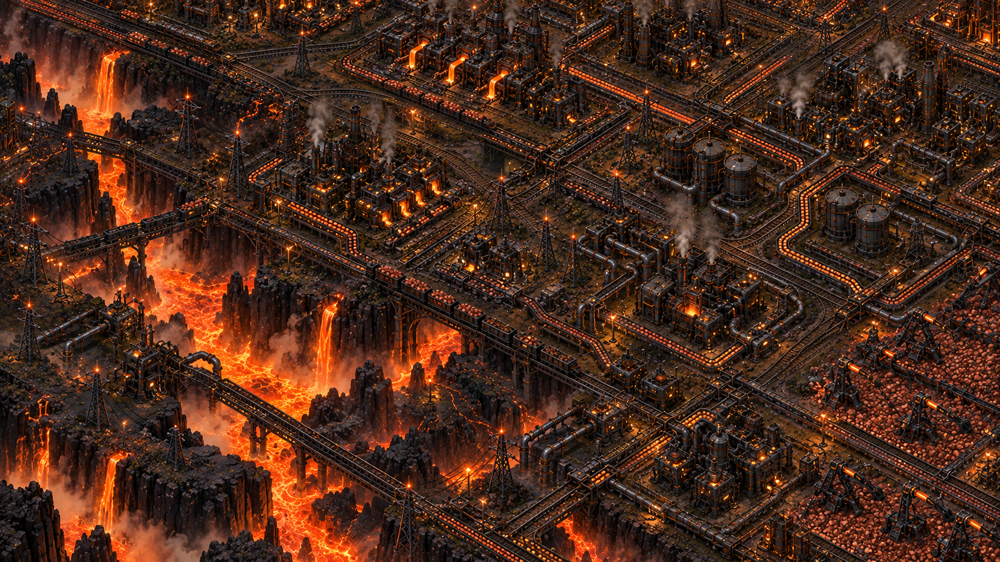

# Factorio Theme for Omarchy

A dark, industrial Omarchy theme built around charcoal steel, machine greens, and furnace orange.

The theme includes generated wallpapers for several Factorio planets. See [ATTRIBUTION.md](ATTRIBUTION.md) for wallpaper details.



## Install

```sh
omarchy theme install https://github.com/catlee/omarchy-factorio-theme
```

Or, to use a local checkout:

```sh
ln -s "$PWD" ~/.config/omarchy/themes/factorio
omarchy theme set factorio
```
